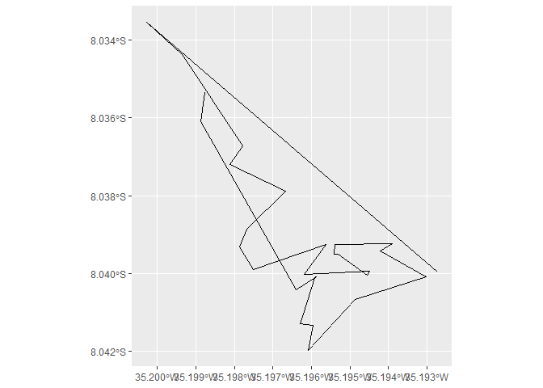

# Calculating coordinates based on Azhimute degrees and distances with R

``` math

\varphi_{2} = \arcsin \left ( \sin(\varphi_{1}) * \cos \left (\frac{d}{R} \right) + \cos \left (\varphi_{1} \right) * \sin \left (\frac{d}{R} \right) * \cos \left (\theta \right) \right)
```

``` math

\lambda_{2} = \lambda_{1} + \arctan^2 \left(\sin \left(\theta \right) * \sin \left(\frac{d}{R} \right) * \cos \left (\varphi_{1} \right) * \cos \left (\frac{d}{R} \right) - \sin(\varphi_{1}) * \sin(\varphi_{2})\right)
```

# Packages

``` r
library(readxl)

library(tidyverse)

library(geosphere)

library(sf)
```

# Data

## Importing

``` r
coord <- readxl::read_xlsx("coordinates.xlsx")
```

## Visualizing

``` r
coord |> as.data.frame()
```

    ##         long       lat    azimuthe  distance
    ## 1  -35.19630 -8.041286   66.266246 173.26567
    ## 2         NA        NA  -25.554144 142.67860
    ## 3         NA        NA -163.605537 212.63355
    ## 4         NA        NA    9.468649 234.52521
    ## 5         NA        NA  129.068205  43.38277
    ## 6         NA        NA  118.019797 102.67019
    ## 7         NA        NA   27.994240  62.62552
    ## 8         NA        NA   57.822470  42.68872
    ## 9         NA        NA -141.763858 115.77122
    ## 10        NA        NA   87.009513 200.22217
    ## 11        NA        NA -115.273850  34.53868
    ## 12        NA        NA -121.645310 398.16752
    ## 13        NA        NA  -11.313027 174.82057
    ## 14        NA        NA  -52.624631 203.44676
    ## 15        NA        NA  136.644757 264.49022
    ## 16 -35.19622 -8.041044  -48.150741 191.55455
    ## 17        NA        NA   -8.786704 116.26142
    ## 18        NA        NA  -15.296834 189.18589
    ## 19        NA        NA  -33.669049 148.02182
    ## 20        NA        NA  -15.748435 196.30354
    ## 21        NA        NA  -48.051563 138.33351
    ## 22        NA        NA  139.958964 260.82950
    ## 23        NA        NA  172.717910 132.86521
    ## 24        NA        NA  102.651128  92.57782
    ## 25        NA        NA  136.280175 178.10471
    ## 26        NA        NA  136.771586 207.44113
    ## 27        NA        NA -148.445689 111.75969
    ## 28        NA        NA  -71.164384  32.35266
    ## 29        NA        NA  102.568789  36.70519
    ## 30        NA        NA   66.266246 173.26567

``` r
coord |> dplyr::glimpse()
```

    ## Rows: 30
    ## Columns: 4
    ## $ long     <dbl> -35.19630, NA, NA, NA, NA, NA, NA, NA, NA, NA, NA, NA, NA, N~
    ## $ lat      <dbl> -8.041286, NA, NA, NA, NA, NA, NA, NA, NA, NA, NA, NA, NA, N~
    ## $ azimuthe <dbl> 66.266246, -25.554144, -163.605537, 9.468649, 129.068205, 11~
    ## $ distance <dbl> 173.26567, 142.67860, 212.63355, 234.52521, 43.38277, 102.67~

# Calculating coordinates

## Creating a coordinates calculating function

``` r
coord_calcule <- function(id){
  
  if(coord$long[id] |> is.na() | coord$lat[id] |> is.na()){
    
    coordinate <- geosphere::destPoint(p = coord[id - 1, 1:2],
                                       b = coord[id - 1, 3],
                                       d = coord[id - 1, 4])
    
    coord$long[id] <<- coordinate[1]
    
    coord$lat[id] <<- coordinate[2]
    
  }
  
}
```

## Executing loop

``` r
purrr::walk(1:nrow(coord), coord_calcule)

coord |> as.data.frame()
```

    ##         long       lat    azimuthe  distance
    ## 1  -35.19630 -8.041286   66.266246 173.26567
    ## 2  -35.19486 -8.040656  -25.554144 142.67860
    ## 3  -35.19542 -8.039492 -163.605537 212.63355
    ## 4  -35.19597 -8.041336    9.468649 234.52521
    ## 5  -35.19562 -8.039244  129.068205  43.38277
    ## 6  -35.19531 -8.039492  118.019797 102.67019
    ## 7  -35.19449 -8.039928   27.994240  62.62552
    ## 8  -35.19422 -8.039428   57.822470  42.68872
    ## 9  -35.19389 -8.039222 -141.763858 115.77122
    ## 10 -35.19454 -8.040044   87.009513 200.22217
    ## 11 -35.19273 -8.039950 -115.273850  34.53868
    ## 12 -35.19301 -8.040083 -121.645310 398.16752
    ## 13 -35.19609 -8.041972  -11.313027 174.82057
    ## 14 -35.19640 -8.040422  -52.624631 203.44676
    ## 15 -35.19787 -8.039306  136.644757 264.49022
    ## 16 -35.19622 -8.041044  -48.150741 191.55455
    ## 17 -35.19751 -8.039889   -8.786704 116.26142
    ## 18 -35.19767 -8.038850  -15.296834 189.18589
    ## 19 -35.19813 -8.037200  -33.669049 148.02182
    ## 20 -35.19887 -8.036086  -15.748435 196.30354
    ## 21 -35.19936 -8.034378  -48.051563 138.33351
    ## 22 -35.20029 -8.033542  139.958964 260.82950
    ## 23 -35.19877 -8.035347  172.717910 132.86521
    ## 24 -35.19861 -8.036539  102.651128  92.57782
    ## 25 -35.19779 -8.036722  136.280175 178.10471
    ## 26 -35.19668 -8.037886  136.771586 207.44113
    ## 27 -35.19539 -8.039253 -148.445689 111.75969
    ## 28 -35.19592 -8.040114  -71.164384  32.35266
    ## 29 -35.19620 -8.040019  102.568789  36.70519
    ## 30 -35.19587 -8.040092   66.266246 173.26567

## Converting to a shapefile

``` r
coord_sf <- coord |> 
  sf::st_as_sf(coords = c("long", "lat"),
               crs = 4674) |> 
  dplyr::summarise(do_union = TRUE) |> 
  sf::st_cast("LINESTRING")

coord_sf
```

    ## Simple feature collection with 1 feature and 0 fields
    ## Geometry type: LINESTRING
    ## Dimension:     XY
    ## Bounding box:  xmin: -35.20029 ymin: -8.041972 xmax: -35.19273 ymax: -8.033542
    ## Geodetic CRS:  SIRGAS 2000
    ## # A tibble: 1 x 1
    ##                                                                        geometry
    ##                                                               <LINESTRING [B0]>
    ## 1 (-35.19273 -8.03995, -35.20029 -8.033542, -35.19936 -8.034378, -35.19779 -8.~

## Visualizing as a map

``` r
ggplot() +
  geom_sf(data = coord_sf)
```

<!-- -->

